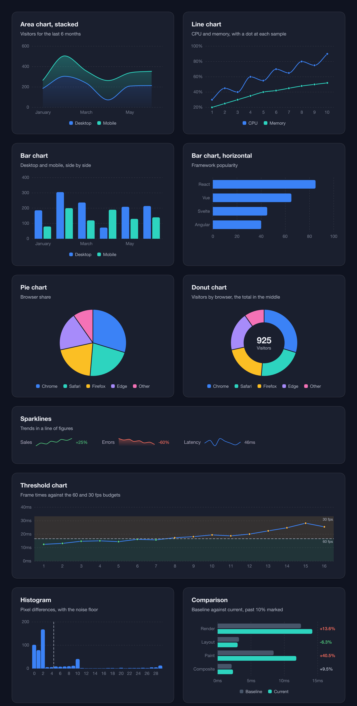
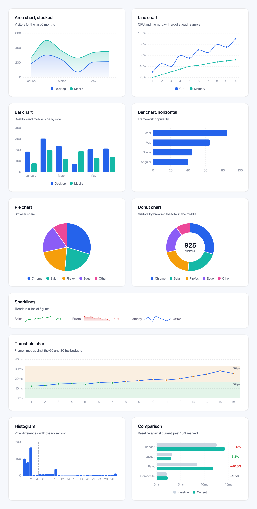
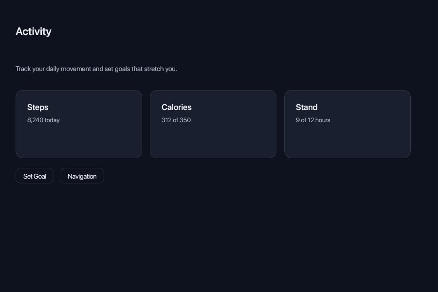
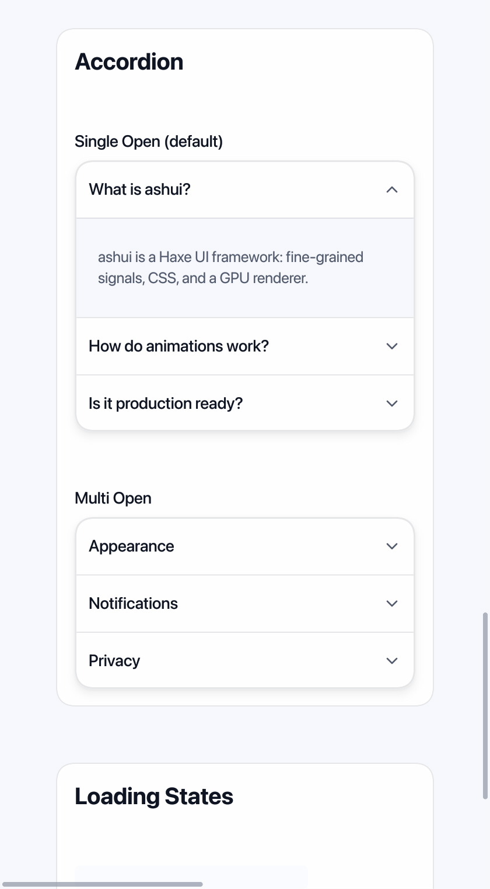
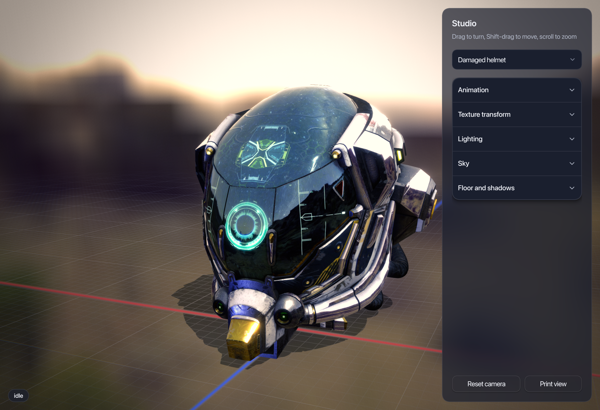

# ashui

ashui is a native, reactive UI framework for Haxe. Build interfaces with typed
HXX elements and reusable controls, style them with CSS or Tailwind-style
classes, and add themes and animations. Optional libraries provide 2D/3D
canvases and audio/video APIs.

## Usage

Save this as `Hello.hx` in your app directory:

```haxe
import ashui.app.WindowedApp;
import ashui.components.Button;
import ashui.reactive.Reactive;

class Hello {
    static function main() {
        WindowedApp.run({title: "Hello ashui", width: 420, height: 240}, () -> {
            var count = signal(0);
            var label = computed(() -> 'Clicked ${count.get()} times');
            return <div class="flex flex-col items-center justify-center gap-4 p-6 bg-background"
                width={420} height={240}>
                <text class="text-2xl font-semibold">Hello, ashui</text>
                <button type="button" onClick={_ -> count.set(count.get() + 1)}>
                    ${label.get()}
                </button>
            </div>;
        });
    }
}
```

## Quick setup

Install **Haxe 4.3.6+** and [Ash](https://ash.rayzor.tech/#setup), then install
the libraries with haxelib:

```sh
haxelib install ashui
haxelib install ashui-components
```

Dependencies, including hlwgpu and hlwindow, are installed automatically.
Save this as `build.hxml` beside `Hello.hx`:

```hxml
-lib ashui
-lib ashui-components

# Required framework setup (also supplied by ashui's extraParams.hxml).
--macro ashui.core.render.UiFramework.register()
--macro ashui.ui.Markup.enable()

-main Hello
-hl bin/hello.hl
```

Compile and run:

```sh
haxe build.hxml
ash bin/hello.hl
```

HXX is part of the framework: `<div>`, `<text>` and imported component tags
are typed Haxe expressions. The release packages include native libraries;
compilation copies the host libraries beside your `.hl` file.

## Building UI

The native backend uses Blinc, hlwgpu for rendering and hlwindow for windows.
Compose elements directly in Haxe using HXX. Imported components become tags
such as `<button>`, `<calendar>` and `<dialog>`.

Style with CSS, Tailwind-style classes and theme tokens. Transitions, springs
and layout animations handle motion; `Machine` handles transient states.

## Styling

Use familiar CSS for selectors, inherited typography, custom properties,
`@media` queries, transitions and keyframe animations. States such as
`:hover`, `:focus-visible`, `:disabled` and `:checked` follow the controls.
Theme variables such as `--primary`, `--surface` and `--radius-lg` follow
light and dark schemes.

Tailwind-style classes put layout, spacing, colors and effects directly in
HXX, with state variants and compile-time checking:

```haxe
<div class="flex flex-col gap-3 p-6 rounded-2xl border border-border bg-surface hover:bg-surface-elevated">
    <text class="text-lg font-semibold">Styled in HXX</text>
    <text class="text-sm text-secondary">Theme colors follow the active scheme.</text>
</div>
```

Load application CSS with `Css.add(CompiledCss.file("app.css"))` from
`ashui.css`; it is parsed and embedded at compile time. Declare custom class
names with `-D ashui_css=app.css` in `build.hxml`. Utility classes and explicit
element attributes take precedence over stylesheet rules. Components load
their base CSS automatically, below application styles.

## Reactive state

State and UI bindings share Blinc's reactive dependency graph. Reading a
signal inside a computed, a watch's read function, or an HXX binding records
a dependency automatically. Changes propagate through those connections to
the affected values and elements. Dependencies follow what each expression
actually reads, including conditional branches.

- **`signal(value)`** holds mutable state; read with `get()` and update
  with `set(value)`.
- **`computed(() -> ...)`** derives a value from signals or other
  computeds. It tracks its reads and keeps the result current. Its function
  should only read state.
- **`watch(read, react)`** handles side effects. `read` tracks dependencies;
  `react` runs once initially, then at the next layout flush when its value
  changes. Several updates before a flush produce one reaction with the latest
  value. Reactions can update state and create or remove UI.
- **`Owner`** scopes elements, computeds, watches and cleanup callbacks.
  Components, `<for>` items and `<show>` branches have their own scopes, so
  removing UI disposes its bindings and resources. Signals can outlive a scope
  and be shared between components.

Numbers, booleans, strings and style values use native signals; objects stay
in Haxe while participating in the same graph. HXX text and attributes can
read state directly, as the counter example above does.
Import `ashui.reactive.Reactive` for these shortcuts. Components can also use
`@:state` fields, which read and write like ordinary Haxe properties.

## Libraries

| Haxelib | Includes |
| --- | --- |
| `ashui` | Elements, reactivity, layout, CSS, themes, input and animation |
| [`ashui-components`](https://github.com/rayzor-blade/ashui/blob/main/components/README.md) | Buttons, forms, menus, dialogs, calendars and more |
| [`ashui-canvaskit`](https://github.com/rayzor-blade/ashui/blob/main/canvaskit/README.md) | Interactive 2D canvases and 3D scenes |
| [`ashui-media`](https://github.com/rayzor-blade/ashui/blob/main/media/README.md) | Audio/video playback, codecs, streams and equalization through hlavi |

## Showcase

### Default theme

The same [chart gallery](https://github.com/rayzor-blade/ashui/blob/main/tools/snapshot/scenes/ChartsGallery.hx)
with themed cards, typography and charts in both schemes:

| Dark | Light |
| --- | --- |
|  |  |

### Motion

Native captures of the existing demos: drawer transitions and spring return,
plus accordion layout expansion and chevron rotation.

| [DrawerMotion](https://github.com/rayzor-blade/ashui/blob/main/tools/snapshot/scenes/DrawerMotion.hx) | [AccordionMotion](https://github.com/rayzor-blade/ashui/blob/main/tools/snapshot/scenes/AccordionMotion.hx) |
| --- | --- |
|  |  |

### Canvas and media

| [Studio3D](https://github.com/rayzor-blade/ashui/blob/main/tools/demo/Studio3D.hx) | [MediaPlayback](https://github.com/rayzor-blade/ashui/blob/main/tools/demo/MediaPlayback.hx) |
| --- | --- |
|  |  |

Helmet by [theblueturtle_](https://sketchfab.com/models/b81008d513954189a063ff901f7abfe4)
(CC BY-NC); HDR sky from Poly Haven (CC0).

## Repository demos and tests

Browse the [demos](https://github.com/rayzor-blade/ashui/tree/main/tools/demo)
and [snapshot scenes](https://github.com/rayzor-blade/ashui/tree/main/tools/snapshot/scenes)
for more examples. The repository's
[offscreen runner](https://github.com/rayzor-blade/ashui/blob/main/tools/snapshot/run.sh)
captures PNGs offscreen; `--watch` captures again when a scene,
styles or framework change. These development tools live in the source
repository, rather than the installed packages.

Licensed under [Apache 2.0](https://github.com/rayzor-blade/ashui/blob/main/LICENSE).
