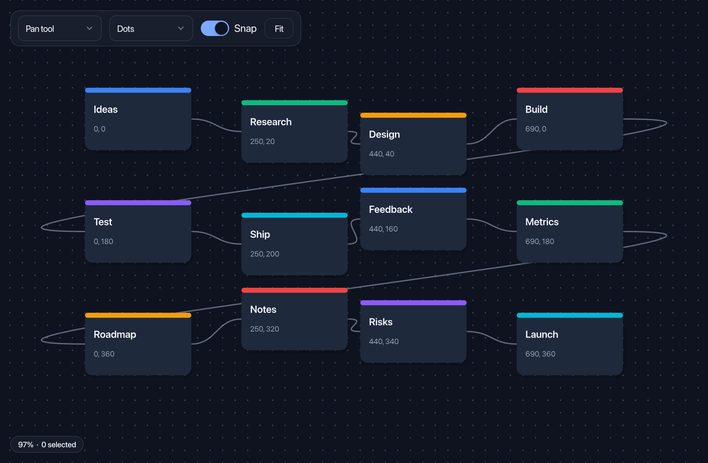

# ashui-canvaskit

Interactive 2D canvases and 3D viewports for ashui. Use `<canvas-kit>` for
boards, diagrams and editors, or `<scene-kit>` for mesh and glTF scenes.
Both compose with HXX controls and share ashui's layout, clipping and opacity.

## Setup

```sh
haxelib install ashui-canvaskit
```

This installs ashui and its dependencies. Use [Ash](https://ash.rayzor.tech/#setup)
to run the compiled app. Save this as `build.hxml`:

```hxml
-lib ashui-canvaskit
--macro ashui.ui.Markup.enable()
-main CanvasDemo
-hl bin/canvas.hl
```

## 2D example

Save as `CanvasDemo.hx`, then run `haxe build.hxml` and `ash bin/canvas.hl`:

```tsx
import ashui.app.WindowedApp;
import ashui.canvaskit.CanvasKit;
import ashui.reactive.Reactive;
import ashui.types.Brush;

class CanvasDemo {
    static function main() {
        WindowedApp.run({title: "Canvas", width: 640, height: 480}, () -> {
            var items = signal([{id: "card", x: 80.0, y: 80.0}]);
            var normal = Brush.solid(0x64748b);
            var selected = Brush.solid(0x3b82f6);
            return <canvas-kit width={640} height={480} tool={Select} snap={16.0}
                draw={(ctx, kit) -> for (item in items.get()) {
                    ctx.fillRect(item.x, item.y, 120, 80,
                        kit.selection.has(item.id) ? selected : normal, 12);
                    kit.region(item.id, item.x, item.y, 120, 80);
                }}
                onDrag={(ids, dx, dy) -> items.set([for (item in items.get())
                    {id: item.id, x: item.x + (ids.contains(item.id) ? dx : 0),
                        y: item.y + (ids.contains(item.id) ? dy : 0)}])} />;
        });
    }
}
```

The draw callback uses content coordinates; pan and zoom are applied for you.
Register selectable objects with `kit.region()`. The kit reports drag deltas;
your application updates its data, as above.

| Interaction | Behavior |
| --- | --- |
| Empty left drag | Pan by default; marquee selection with `tool={Select}` |
| Middle/right drag | Pan, with momentum on release |
| Wheel | Zoom around the pointer |
| Shift-wheel or horizontal scroll | Pan |
| Click / Shift-click / Cmd or Ctrl-click | Select / add / toggle |
| Shift-drag empty space | Marquee selection |

Supply `Viewport2D` and `Selection2D` to share or control view state. Use
`snap` for a drag grid, `kit.visible()` to skip objects outside the view,
and `kit.fitContent()` to ease the view around all or selected regions.
`Background2D` provides dots, grid, crosshatch or no pattern.

## 3D scenes

Inside your app's UI builder:

```tsx
import ashui.canvaskit.Geometry;
import ashui.canvaskit.SceneKit;

var box = Geometry.box();
return <scene-kit width={640} height={480} antialias={true}
    draw={ctx -> ctx.drawMesh(box)} />;
```

`SceneKit` supplies an orbit camera and default lighting. Drag to orbit,
Shift-drag or right-drag to pan, and scroll to zoom. Supply `OrbitCamera`
to control or share camera state; `controls={false}` disables camera input.

- **Geometry and assets:** `Geometry` builds primitives and terrain;
  `Gltf.load()` reads glTF/GLB models. `GltfPose` and `GltfAnimation` handle
  node transforms, skins, morph targets and animation playback.
- **Lighting:** configure lights and ambient strength, use `Environment`
  for HDR lighting, `Skybox` for a visible sky and `GroundGrid` for a floor.
  Directional lights can cast shadows.
- **Effects:** exposure, fog, bloom, color grading, vignette, grain,
  chromatic aberration, lens distortion, motion blur and FXAA.

## Reactive drawing

Signals read by a draw callback become dependencies. Changes to those signals,
the viewport or camera request a new frame. Set `animate={true}` when content
needs continuous frames; call `repaint()` on a `CanvasKit` reference when
external GPU content changes. Use `paint` for a custom GPU pass at the canvas's
position in the UI paint order.

## Gallery

[Canvas2D](https://github.com/rayzor-blade/ashui/blob/main/tools/demo/Canvas2D.hx)
combines a connected board with pan, zoom, selection, snapping and HXX controls:



[Studio3D](https://github.com/rayzor-blade/ashui/blob/main/tools/demo/Studio3D.hx)
combines glTF rendering, HDR lighting and a frosted panel of reusable controls.
The accordion sections start collapsed:


Helmet by [theblueturtle_](https://sketchfab.com/models/b81008d513954189a063ff901f7abfe4)
(CC BY-NC); HDR sky from Poly Haven (CC0).

The [source](https://github.com/rayzor-blade/ashui/tree/main/canvaskit/haxe/ashui/canvaskit) documents individual APIs and props.

Licensed under [Apache 2.0](https://github.com/rayzor-blade/ashui/blob/main/LICENSE).
