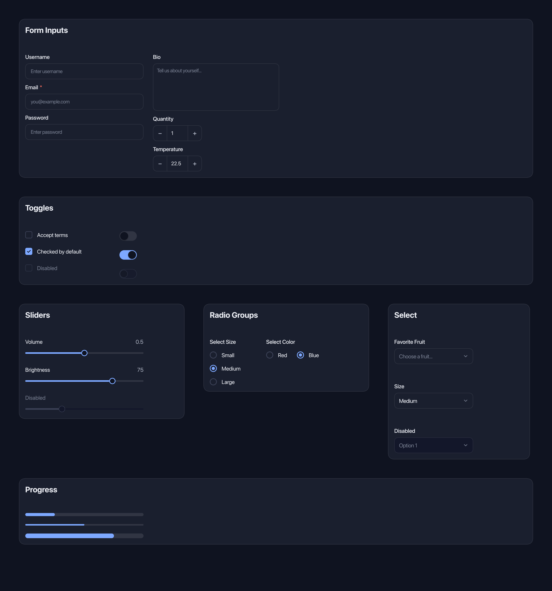
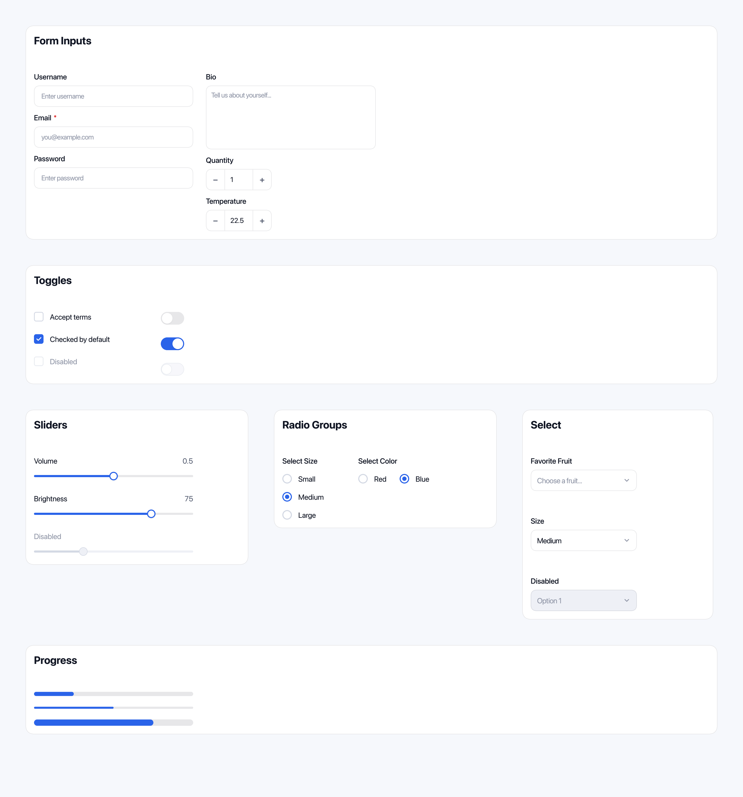
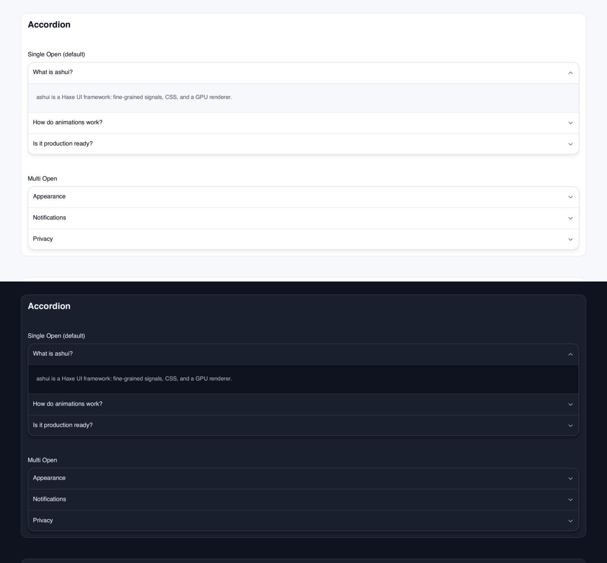

# ashui-components

Reusable controls built from ashui elements. Components bring their keyboard,
focus, pointer and dismissal behavior, with a shared CSS and theme vocabulary.
Compose them as typed HXX tags and customize their appearance with CSS.

## Setup

```sh
haxelib install ashui-components
```

This installs ashui and its dependencies. Use [Ash](https://ash.rayzor.tech/#setup)
to run the compiled app. Save this as `build.hxml`:

```hxml
-lib ashui-components
--macro ashui.ui.Markup.enable()
-main ComponentsDemo
-hl bin/components.hl
```

## Example

Save as `ComponentsDemo.hx`, then run `haxe build.hxml` and `ash bin/components.hl`:

```tsx
import ashui.app.WindowedApp;
import ashui.components.Button;
import ashui.components.Card;
import ashui.components.ToggleSwitch;
import ashui.reactive.Reactive;

class ComponentsDemo {
    static function main() {
        WindowedApp.run({title: "Preferences", width: 420, height: 280}, () -> {
            var notifications = signal(true);
            return <div class="p-6 bg-background" width={420} height={280}>
                <card>
                    <card-header>
                        <card-title>Notifications</card-title>
                        <card-description>Choose when to hear from us.</card-description>
                    </card-header>
                    <card-content class="flex items-center justify-between">
                        <text>${notifications.get() ? "Enabled" : "Disabled"}</text>
                        <toggle-switch checked={notifications} />
                    </card-content>
                    <card-footer>
                        <button type="button" variant={Outline}
                            onClick={_ -> notifications.set(true)}>Reset</button>
                    </card-footer>
                </card>
            </div>;
        });
    }
}
```

Import the component module to use its tags: `Card` brings `<card>` and its
parts, including `<card-header>` and `<card-title>`.

## State and behavior

Pass a signal to editable props such as `checked`, `value` or `open` to share
state with the control. User edits write back to that signal; changing it in
your code updates the control. Constants set initial state, while computeds
let a control follow derived state. Change callbacks report the events
documented by each component.

Buttons support focus, Enter and Space. Form buttons default to submitting;
use `type="button"` for other actions. Dialogs manage modal focus and restore
it on close; popovers and menus handle their own navigation and dismissal.

## Controls

| Area | Components |
| --- | --- |
| Forms | Input, Textarea, NumberInput, InputOtp, Checkbox, RadioGroup, ToggleSwitch, Slider |
| Selection | Select, Combobox, Calendar with `minYear` and `maxYear` |
| Overlays | Dialog, Sheet, Drawer, Popover, Tooltip, HoverCard, Toast |
| Navigation | Tabs, Accordion, DropdownMenu, ContextMenu, Menubar, TreeView, Sidebar |
| Content | Card, Badge, Avatar, Alert, Table, Chart, Progress, Spinner, Skeleton |
| Layout | ScrollArea, Resizable, AspectRatio, Separator |

Each [component source](https://github.com/rayzor-blade/ashui/tree/main/components/haxe/ashui/components) documents its props, parts,
events and CSS hooks.

## Gallery

The existing [FormsGallery](https://github.com/rayzor-blade/ashui/blob/main/tools/snapshot/scenes/FormsGallery.hx)
shows fields, switches, sliders, radio groups, selects and progress in the default theme.

| Dark | Light |
| --- | --- |
|  |  |

The accordion section of
[ComponentsGallery](https://github.com/rayzor-blade/ashui/blob/main/tools/snapshot/scenes/ComponentsGallery.hx)
shows single and multiple open sections in both schemes:



The same gallery at a compact width, scrolled to its accordion section,
records content expansion, chevron rotation and the movement of the following items:


Browse [ComponentsGallery](https://github.com/rayzor-blade/ashui/blob/main/tools/snapshot/scenes/ComponentsGallery.hx)
for buttons, badges, cards, alerts, tabs and loading states.

## Styling

The [component stylesheet](https://github.com/rayzor-blade/ashui/blob/main/components/css/components.css) loads automatically below
application CSS. Parts have `ui-` classes, such as `.ui-button` and
`.ui-switch-thumb`. Variants and sizes use `data-variant` and `data-size`;
interactive states use selectors such as `:hover`, `:checked` and
`:focus-visible`.

Override theme tokens for a shared look, or component properties such as
`--ui-button-bg` and `--ui-card-radius` for a local change. Standard layout
attributes and Tailwind-style classes apply to component roots.

See [CalendarMotion](https://github.com/rayzor-blade/ashui/blob/main/tools/snapshot/scenes/CalendarMotion.hx),
[SortableList](https://github.com/rayzor-blade/ashui/blob/main/tools/demo/SortableList.hx) and the
[component tests](https://github.com/rayzor-blade/ashui/blob/main/tests/Components.hx) for larger compositions.

Licensed under [Apache 2.0](https://github.com/rayzor-blade/ashui/blob/main/LICENSE).
