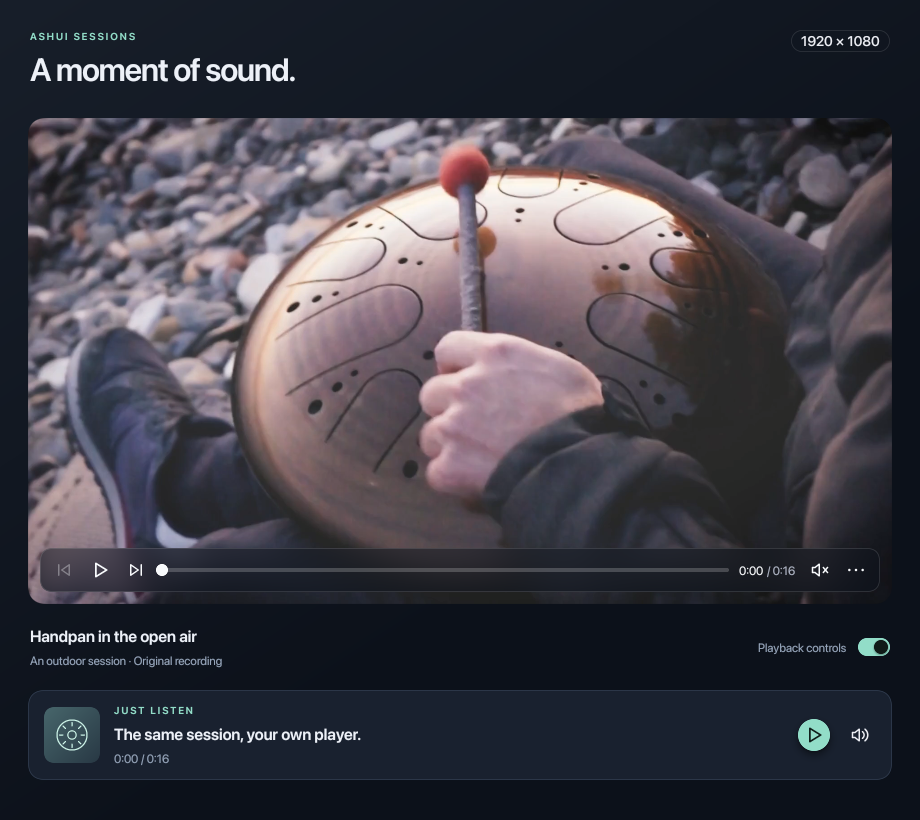

# ashui-media

Audio/video playback components, equalization, codecs and bounded streams backed by **hlavi**.
Install `ashui-media` in applications that need media support.
Native playback owns audio output, decoding and the audio/video clock. Video
frames upload to reusable GPU textures through **CanvasKit**, with ashui's
transforms, clipping, rounded corners and opacity.

## Setup

Install with haxelib:

```sh
haxelib install ashui-media
```

Add `-lib ashui-media` to your app's [build.hxml](https://github.com/rayzor-blade/ashui/blob/main/README.md#quick-setup).
Haxelib installs ashui, components, canvaskit and hlavi as dependencies.
The packages enable HXX and stage the native libraries beside the bytecode;
run it with [Ash](https://ash.rayzor.tech/#setup).

## Playback example

The existing [MediaPlayback demo](https://github.com/rayzor-blade/ashui/blob/main/tools/demo/MediaPlayback.hx)
uses the default video controls over a blurred overlay, alongside a custom HXX audio player.



## HXX tags

```tsx
import ashui.media.Video;
import ashui.media.Audio;
import ashui.media.VideoFit;

return <div class="flex flex-col gap-4">
  <video src={videoPath} autoplay={true} muted={true} loop={true} fit={VideoFit.Contain} />
  <audio src={audioPath} />
</div>;
```

Both tags accept reactive `src`, `autoplay`, `loop`, `volume` (0–1), `muted`, `equalizer`,
and `controls`, plus `onReady`, `onEnded`, `onError`, and `id`. Default controls
are optional: **`controls={false}`** renders the surface and supplied children.
`Video.fit` accepts `Contain`, `Cover` or `Fill` and can change reactively.
Standard layout attributes and CSS classes apply to the component's root.

A component creates and closes its own player. Supplying `player={controller}`
shares a caller-owned controller; unmounting the component leaves it alive.
Use `ref={videoRef}` or `ref={audioRef}` to access an internally created
controller through `.player`.

## Custom playback UI

```tsx
import ashui.components.Button;
import ashui.media.Player;
import ashui.media.Video;
import ashui.reactive.Computed;
import ashui.reactive.Owner;

var player = new Player(path, {muted: true});
var playing = Computed.make(() -> player.isPlaying());
Owner.onCleanup(player.close);
return <div class="flex flex-col gap-3">
  <video player={player} controls={false} />
  <button type="button" onClick={_ -> player.toggle()}>
    ${playing.get() ? "Pause" : "Play"}
  </button>
  <text>${player.position.get() + " / " + player.duration.get()}</text>
</div>;
```

The default `PlaybackControls` can also be placed separately, as
`<playback-controls player={player} />`. It reuses framework **Button** and
**Slider**, including their keyboard, focus and pointer behavior. Play/Pause
is an icon button. HXX children can supply any additional UI. Video controls
overlay the video with a translucent background and backdrop blur; the
reactive `controls` prop shows or hides them without resizing the video.
The single row has backward/forward 10-second seeks, Play/Pause, a timeline,
elapsed/total time, a speaker icon and a menu for repeat/restart. Timeline
clicks, drags and keyboard edits seek; playback updates only move its thumb.
`<volume-control player={player} />` opens a compact horizontal slider,
percentage and mute icon button, using the existing Popover focus/dismissal behavior.

Video controls fade out after two seconds without pointer movement during
playback and return when the pointer moves over or re-enters the video.
Paused controls stay visible, as do controls with keyboard focus or an open
volume/menu popup. `autoHideControls={false}` keeps them visible;
`controlsHideDelay={3}` changes the delay in seconds. Both the default
controls and custom HXX children remain optional. `video.controlsVisible`
reports the auto-hide state.

## Controller API

`new Player(?path, ?options)` accepts `autoplay`, `loop`, `volume`, `muted`, `equalizer`
and an optional animation scheduler. It works independently of UI owners.

| Method | Behavior |
| --- | --- |
| `load(path, ?autoplay)` | Replace the file; an empty path unloads it |
| `play()`, `pause()`, `toggle()` | Control native playback; play restarts EOF |
| `seek(seconds)` | Bound the seek to the file; update a paused video frame |
| `setVolume(value)`, `setMuted(value)` | Control volume while preserving the unmuted level |
| `setLoop(value)` | Restart playback at EOF |
| `setEqualizer(equalizer)`, `clearEqualizer()` | Attach shared settings or restore flat playback |
| `currentFrame()` | Clone the latest video frame; **caller must close it** |
| `update()` | Poll on the opening thread; normally the UI scheduler does this |
| `close()` / `dispose()` | Terminal, idempotent release of player and frames |

Signals expose `source`, `state`, `error`, `position`, `duration`, `volume`,
`muted`, `looping`, `equalizer`, `videoWidth`, `videoHeight`, and `frameVersion`. Read them
to build UI; change playback through methods. Times are **seconds**. The FSM
owns `Opening`, `Seeking`, `Buffering` and the stable playback states, with
opening/seek timers canceled on transitions and disposal. `stateName()`
returns the lowercase CSS state; `isPlaying()` preserves playback intent
through buffering and seeks, including a seek while paused.

Drive playback on the **main event-loop thread**. Native playback uses real
time, independently of animation steps. A standalone host must pump its
platform event loop as the framework's window loop does. Paused playback
stops polling after its preview/seek settles; audio labels update at 10 Hz.

## Equalizer

`ashui.media.Equalizer` wraps hlavi's native peaking-band DSP for both playback
and decoded PCM. Developers can build their own controls using its reactive
settings and methods. The default five bands are **60, 250, 1000, 4000 and 12000 Hz**,
enabled at zero gain and Q=1. Supply 1–16 frequencies for another arrangement.

```tsx
import ashui.media.Equalizer;
import ashui.media.Audio;

var eq = new Equalizer();
eq.setGain(0, 4);
eq.setGain(4, 2);
eq.setPreamp(-6);
return <audio src={audioPath} equalizer={eq} />;
```

`<video equalizer={eq} />` accepts the same controller. `equalizer` can be a
signal or expression; replacing it detaches the previous controller, and null
restores flat playback. A controller can be shared by several players.
Settings edits update all attached players immediately, including paused
players, and persist across source reloads. Each player owns its independent
filter history. Passing an equalizer does not change volume, mute or playback
state.

| Method | Behavior |
| --- | --- |
| `new Equalizer(?frequencies)` | Create flat, enabled bands with the given center frequencies |
| `setBand(index, frequency, gainDb, q)` | Configure and enable a band; Hz 1–96000, gain −24…+24 dB, Q 0.1–20 |
| `setGain(index, gainDb)` | Change gain and enable the band, preserving its frequency and Q |
| `disableBand(index)` | Bypass one band while retaining its settings |
| `setPreamp(gainDb)` | Set input headroom, −60…0 dB |
| `setBypass(value)` | Bypass both bands and preamp, preserving the settings |
| `flatten()` | Restore zero gains and preamp, retaining frequencies, Q and bypass |
| `process(audioData)` | Borrow PCM input and return owned interleaved F32 output |
| `reset()` | Clear the controller's PCM processing history, preserving settings |
| `close()` / `dispose()` | Release DSP and detach every attached player; terminal and idempotent |

Read `bands[index].get()` for `{frequency, gainDb, q, enabled}`, `preamp.get()`
and `bypassed.get()` to observe settings. Change settings through the
methods. `revision` changes on settings edits or close; `disposed` is also
reactive. Invalid settings throw and preserve the current configuration.
Boosted bands may need negative preamp to avoid clipping at native playback's
output. The native DSP smooths settings changes over 10 ms; frequencies at or
above half the input sample rate are inactive.

An equalizer created under an Owner closes on cleanup. Standalone callers must
close it. Players never close a caller-owned equalizer; closing the equalizer
restores flat playback for its attached players. `process` keeps history across
contiguous PCM blocks and resets on timing or format changes. Use one controller
per PCM stream and close every returned block; the input remains caller-owned.
Output preserves timestamps, sample rate and channel count. For raw native
handles without reactive integration, `media.AudioEqualizer` remains available.

## Native data API

Use hlavi's existing typed `media` package directly alongside `ashui.media`:

- `media.AudioData`: PCM creation, format conversion, copying and cloning.
- `media.VideoFrame`: pixels, timestamps, visible/display dimensions,
  color metadata, plane layouts, copying and cloning.
- `media.EncodedAudioChunk`, `media.EncodedVideoChunk`: encoded bytes,
  timing, kind and copying.

Timestamps and durations on buffers/chunks are **Int64 microseconds**. Close
each owned data handle and each `PlaneLayouts` returned by `copyTo`. Garbage
collection does not release native media handles. See hlavi's
[MediaData example](https://github.com/rayzor-blade/hlavi/blob/main/examples/MediaData.hx).

## Encoding, decoding and streams

`ashui.media.Codec` uses hlavi's native codec workers. It exposes typed input
and output rather than converting media into UI objects:

| Factory | Input → output |
| --- | --- |
| `Codec.audioEncoder({sampleRate, channels, ?codec, ?bitrate, ?limits})` | `AudioData` → `EncodedAudioChunk` |
| `Codec.videoEncoder({width, height, ?codec, ?bitrate, ?framerate, ?limits})` | `VideoFrame` → `EncodedVideoChunk` |
| `Codec.audioDecoder(configuration, ?limits)` | `EncodedAudioChunk` → `AudioData` |
| `Codec.videoDecoder(configuration, ?limits)` | `EncodedVideoChunk` → `VideoFrame` |

Default profiles are AAC-LC (`Codec.AAC`, `mp4a.40.2`) and H.264 Baseline level 3
(`Codec.H264`, `avc1.42001E`), matching hlavi's platform profiles. Audio defaults
to 128 kbps; video to 2 Mbps and 30 fps. Supply the encoder's owned
`getConfiguration()` result to a decoder or MP4 writer after the first output
is ready, then close that configuration when it is no longer needed.

`ashui.media.Stream` creates typed native queues with `audio()`, `video()`,
`audioChunks()`, `videoChunks()` or `bytes()`. Byte queues copy writes and
preserve block boundaries. Frames/chunks are retained by native reference.

Both codecs and streams share `MediaChannel`:

| Method | Behavior |
| --- | --- |
| `tryWrite(input)` | Nonblocking; false means retain the input and retry after draining output |
| `poll()` | `media.StreamReadStatus.Pending`, `Ready` or `Ended` |
| `read()` | Transfer one ready output to its caller |
| `finish()` | Stop accepting input, flush, and drain before EOF |
| `close()` / `dispose()` | Cancel and release native resources; idempotent |

An accepted write retains its input, so the caller can close its own frame
or chunk handle immediately. A rejected write leaves ownership with the
caller. Every native frame/chunk read must be closed by its caller. A channel
created inside an ashui Owner closes on cleanup; standalone callers close it.
The shared FSM exposes reactive `state` (`Open`, `Backpressured`, `Draining`,
`Ended`, `Failed`, `Closed`) and `error`. Backpressure never drops frames.

```haxe
import ashui.media.Codec;
import haxe.io.Bytes;
import media.StreamReadStatus;

var encoder = Codec.videoEncoder({width: 640, height: 360, framerate: 30,
  limits: {maxItems: 2, maxBytes: 4 * 1024 * 1024}});

// On a producer tick: keep frame if the write is rejected.
if (encoder.tryWrite(frame)) frame.close();

// On later host/UI ticks: consume output without waiting for it.
while (encoder.poll() == StreamReadStatus.Ready) {
  var packet = encoder.read();
  var payload = Bytes.alloc(haxe.Int64.toInt(packet.byteLength()));
  packet.copyTo(payload);
  packet.close();
  // payload now holds the encoded bytes; native packet ownership is released.
}

encoder.finish(); // Continue consuming until poll() reports Ended.
// Close after EOF, or close earlier to cancel.
```

`MediaLimits` bounds item count and bytes on each native queue. Defaults are
8 items and 16 MiB; valid ranges are 1–1024 items and 1 byte–256 MiB. Each
frame/packet must fit its queue's byte budget. Keep a rejected item for retry
and drain output while producing input to avoid blocking a full pipeline.
PCM/AAC timestamps must be contiguous; video timestamps strictly increasing.
All frame/chunk timestamps and durations are Int64 microseconds.

For containers, use hlavi's `media.MediaMuxer` (incremental MP4 writing) and
`media.MediaDemuxer` (incremental local MP4 reading) directly. These expose
the same nonblocking readiness and write-backpressure contracts. Finish the
tracks and writer before opening an exported file with `<video>` or `<audio>`.
The reader supports ordinary, unfragmented MP4 files; a byte queue alone does
not add a network transport or streaming container parser.

## Styling and rendering

The package's [media stylesheet](https://github.com/rayzor-blade/ashui/blob/main/media/css/media.css)
loads below application CSS. Parts are `.ui-media-video`,
`.ui-media-surface`, `.ui-media-audio`, `.ui-media-controls`, `.ui-media-timeline`,
`.ui-media-toolbar`, `.ui-media-time`, `.ui-media-volume-control` and `.ui-media-error`.
Roots expose `[data-state]`; video also exposes `[data-controls="visible"|"hidden"]`.
Customize `--ui-media-height`, `--ui-media-bg`,
`--ui-media-radius`, `--ui-media-controls-bg`, `--ui-media-fg` and
`--ui-media-padding`, `--ui-media-overlay-bg`, `--ui-media-overlay-blur` and
`--ui-media-controls-radius`, or replace controls completely.

Playback currently supplies packed BGRA frames. The renderer also accepts
RGBA, RGBX and BGRX, handles visible crops and display aspect ratios, and
reuses its buffer/textures until dimensions or format change. It draws SDR
color through the framework's normal color target; HDR, rotation metadata,
planar YUV rendering and browser media need additional backend support.

Native file/codec/platform support follows hlavi (Apple, Windows, Android and
Linux). Verification here is on macOS; other platform backends are provided
by hlavi and are not exercised by this repository's macOS run.

## Repository demos and verification

The [source repository](https://github.com/rayzor-blade/ashui) contains these
development runners and scenes. Run the following from a configured framework
checkout; these scripts are not included in the haxelib package.

```sh
tools/demo/run.sh tools/demo/MediaPlayback.hx
tools/snapshot/run.sh tools/demo/MediaPlayback.hx
tools/snapshot/run.sh tools/snapshot/scenes/MediaPlaybackTest.hx
tools/snapshot/run.sh tools/snapshot/scenes/MediaEqualizerTest.hx
tools/demo/run.sh tools/demo/MediaEncoding.hx
tools/snapshot/run.sh tools/demo/MediaEncoding.hx
tools/snapshot/run.sh tools/snapshot/scenes/MediaCodecTest.hx
```

Set `ASHUI_VIDEO` / `ASHUI_AUDIO` to absolute file paths; the demo defaults to
`tools/demo/assets/MediaPlayback.mp4`, copied from hlavi's handpan example.
`HLAVI_HDLL=/path/to/xavi.hdll` uses an existing native
binary in the runners. `ASHUI_MEDIA=1` opts in a scene which imports media
indirectly. Scenes that import `ashui.media` opt in automatically.

The test generates a silent WAV, checks real audio playback, pause, seeking,
looping, EOF/restart, failures, source replacement and native ownership. It
also checks timeline clicks/drags/keys against decoded frame timestamps,
auto-hide/hover/focus behavior, volume changes and control alignment, then
captures contain/cover/fill video and controls offscreen.
Offscreen verification pumps a hidden native window so asynchronous platform
opening/seeking complete. It never advances playback with a simulated clock.

`MediaEncoding` generates frames, passes them through a bounded video stream
and native H.264 encoder, writes an MP4, then uses the existing HXX video
component to play it. `MediaCodecTest` verifies native AAC/H.264 encode/decode,
MP4 export/demux, backpressure, EOF, ownership and reactive channel failures.

`MediaEqualizerTest` checks native gain/preamp/bypass against actual PCM,
live settings changes, shared controllers, reactive HXX bindings, source
reloads and native cleanup.

Licensed under [Apache 2.0](https://github.com/rayzor-blade/ashui/blob/main/LICENSE).
